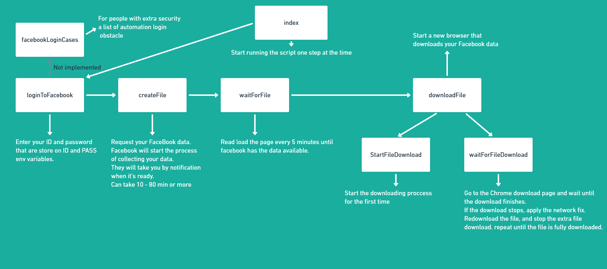

# setup
- create a .env
- create env variables of ID, and PASS
- set them to your id and FaceBook password

## run script
npm run debug

### note
- see the vs code terminal for conselo logs.
- 2 tabs it's to be expected

Setting up the repot is harder that it should be. Had to "git remove remote".